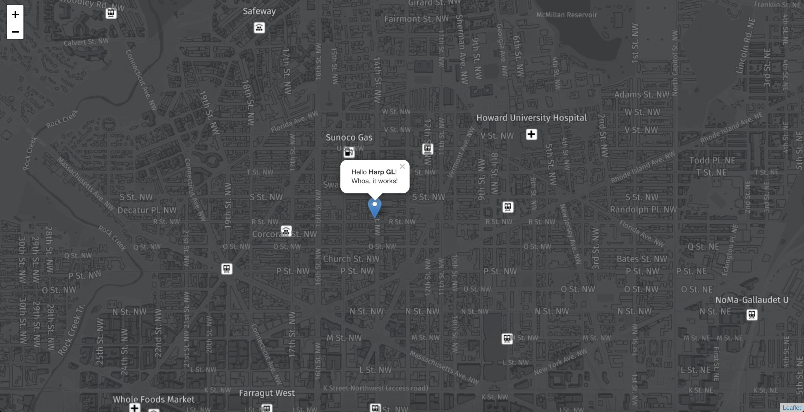

# @here/harp-leaflet [](https://travis-ci.com/heremaps/harp-leaflet)


## Overview

### A Leaflet plugin that adds harp.gl layer

This repository contains the code that can help you create a `harp.gl` layer inside Leaflet



## Usage

### Install harp-leaflet plugin

Run:

```sh
npm install @here/harp-leaflet
```

or

```sh
yarn install @here/harp-leaflet
```

to download and install harp-leaflet plugin package.

### Add harp-leaflet to your Leaflet app

Add:

```js
import { GeoCoordinates } from "@here/harp-geoutils";
import { APIFormat, OmvDataSource } from "@here/harp-omv-datasource";
import { HarpGL } from "harp-leaflet";
import * as L from "leaflet";

// 1. Initialize leaflet map
const map = L.map("map").setView([38.912753, -77.032194], 15);

// 2. (optional) Add Leaflet features you need
L.marker([38.912753, -77.032194])
    .bindPopup("Hello <b>Harp GL</b>!<br>Whoa, it works!")
    .addTo(map)
    .openPopup();

// 3. Add harp.gl layer to leaflet map
const harpGL = new HarpGL().addTo(map);

// 4. Initialize and add harp.gl datasources
const geoJsonDataSource = new OmvDataSource({
    baseUrl: "https://xyz.api.here.com/tiles/osmbase/512/all",
    apiFormat: APIFormat.XYZMVT,
    styleSetName: "here_olp",
    maxZoomLevel: 17,
    authenticationCode: "YOUR_AUTH_CODE",
    concurrentDecoderScriptUrl: "./build/decoder.bundle.js"
});

harpGL.mapView.addDataSource(geoJsonDataSource);

// 5. Point your view to the right place
harpGL.mapView.lookAt(new GeoCoordinates(16, -4, 0), 6000000);
```

## Testing

`harp-leaflet` comes with basic integration tests that run in browser. To run tests in developer
envrionment execute `yarn start-tests --open` which will serve test app in your default browser.

To run tests in "CI-like" mode, you need to first build them and run, both are separate steps:

```
$ yarn build-tests
$ yarn test
```

By default `yarn test` uses [karma](https://github.com/karma-runner/karma) configured to run tests in local headless Chrome using [karma-chrome-launcher](https://github.com/karma-runner/karma-chrome-launcher).

## License

Copyright (C) 2019-2021 HERE Europe B.V.

See the [LICENSE](./LICENSE) file in the root of this project for license details.
